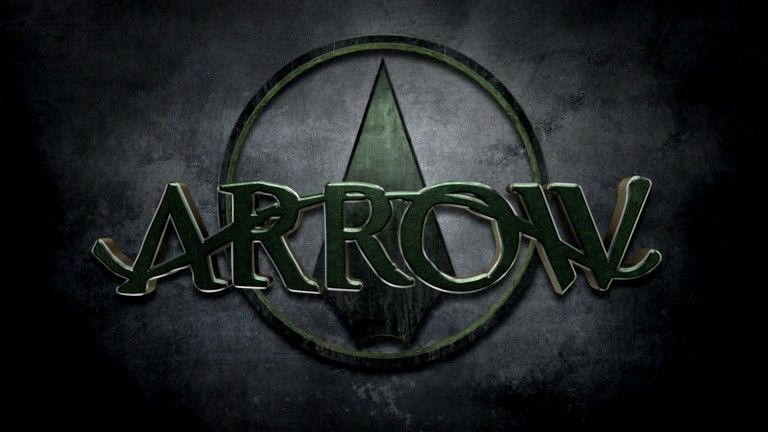
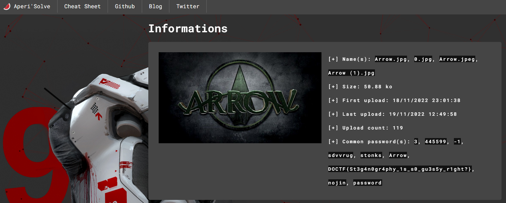
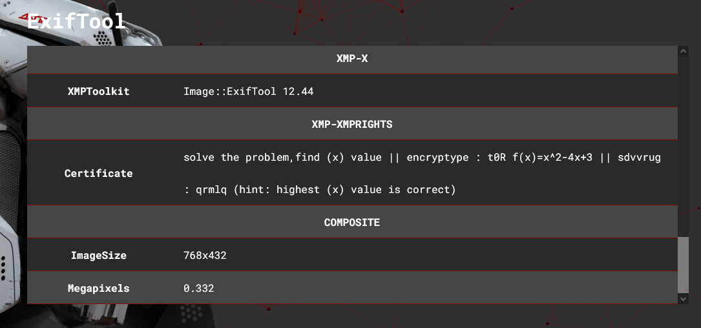

### Arrow - Resolution






```

solve the problem,find (x) value || encryptype : t0R f(x)=x^2-4x+3 || sdvvrug : qrmlq (hint: highest (x) value is correct)

```

[+] Common password(s): 3, 445599, -1, sdvvrug, stonks, Arrow, DOCTF{St3g4n0gr4phy_1s_s0_gu3s5y_r1ght?}, nojin, password


DOCTF{St3g4n0gr4phy_1s_s0_gu3s5y_r1ght?}

TEXT in STRINGS
`sdvvrug : qrmlq`
DCODE: DCODE.FR | Affine 
`password:nojir`

Using STEGHIDE with password `nojin` was able to extract "epic.txt"

```
congrats!!!! good job.

Now you should answer some EZ questions. It's about computer parts . It can help you to learn something, or if you already know, you can easily pass this section!

The zip file password is the answer to one of these questions:

1. Which component on the Motherboard generates the most heat? (hint:three letters).
2. What is the name of the fastest cache on the motherboard?
3. What is the maximum amount of DRAM that a 32-bit system can support?
4. The LGP CPU is mostly used by which company? (Hint: there are two companies that build CPUs; one of them is the answer!)

Four simple questions. :)

But u should know that this is not the last task.....

I will give u some hint, inside the zip file there is a sound track and a photo get the code from the audio file and get access to the file inside the photo.. 

Ik u are saying where tf is the zip file??
Its on my Github repository waiting for you.(hint : ARROW#5141) 
good luck...
```

LOad 

#### ARROW#5141
this is one of the admins on DIGITALOVERDOSE Discord server. This admin also has a Discord server POLYSHPERE
- I didnt find a name that directly tide to this user on the site.
-   https://digitaloverdose.tech/home
- nor a reference to github for same
- looked on YouTube as well
- https://www.youtube.com/c/DigitalOverdose
- https://github.com/digital-overdose


``` Flag :  ```
